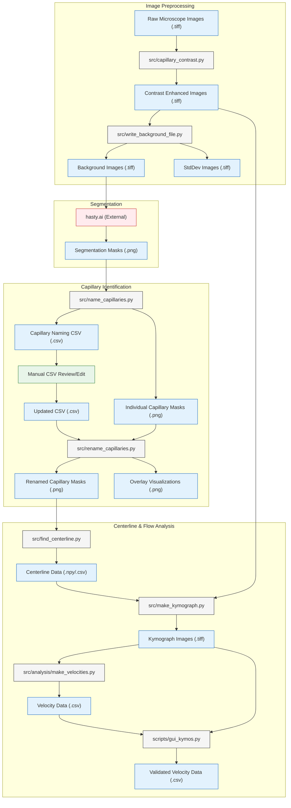

```mermaid
graph TD
    subgraph "Image Preprocessing"
        A["Raw Microscope Images (.tiff)"] --> B["src/capillary_contrast.py"]
        B --> C["Contrast Enhanced Images (.tiff)"]
        C --> D["src/write_background_file.py"]
        D --> E["Background Images (.tiff)"]
        D --> F["StdDev Images (.tiff)"]
    end
    
    subgraph "Segmentation"
        E --> G["hasty.ai (External)"]
        G --> H["Segmentation Masks (.png)"]
    end
    
    subgraph "Capillary Identification"
        H --> I["src/name_capillaries.py"]
        I --> J["Individual Capillary Masks (.png)"]
        I --> K["Capillary Naming CSV (.csv)"]
        K --> L["Manual CSV Review/Edit"]
        L --> M["Updated CSV (.csv)"]
        M --> N["src/rename_capillaries.py"]
        J --> N
        N --> O["Renamed Capillary Masks (.png)"]
        N --> P["Overlay Visualizations (.png)"]
    end
    
    subgraph "Centerline & Flow Analysis"
        O --> Q["src/find_centerline.py"]
        Q --> R["Centerline Data (.npy/.csv)"]
        R --> S["src/make_kymograph.py"]
        C --> S
        S --> T["Kymograph Images (.tiff)"]
        T --> U["src/analysis/make_velocities.py"]
        U --> V["Velocity Data (.csv)"]
        V --> W["scripts/gui_kymos.py"]
        T --> W
        W --> X["Validated Velocity Data (.csv)"]
    end
    
    %% Styling
    classDef script fill:#f5f5f5,stroke:#333,stroke-width:1px
    classDef data fill:#e3f2fd,stroke:#1565c0,stroke-width:1px
    classDef manual fill:#e8f5e9,stroke:#2e7d32,stroke-width:1px
    classDef external fill:#ffebee,stroke:#c62828,stroke-width:1px
    
    class B,D,I,N,Q,S,U,W script
    class A,C,E,F,H,J,K,M,O,P,R,T,V,X data
    class L manual
    class G external
``` 