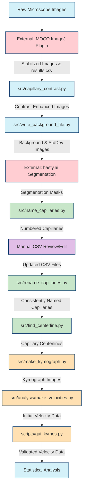

```mermaid
flowchart TD
    %% Image Preprocessing
    A[Raw Microscope Images] --> AA[External: MOCO ImageJ Plugin]
    AA -->|Stabilized Images & results.csv| B[src/capillary_contrast.py]
    B -->|Contrast Enhanced Images| C[src/write_background_file.py]
    C -->|Background & StdDev Images| D[External: hasty.ai Segmentation]
    
    %% Capillary Identification
    D -->|Segmentation Masks| E[src/name_capillaries.py]
    E -->|Numbered Capillaries| F[Manual CSV Review/Edit]
    F -->|Updated CSV Files| G[src/rename_capillaries.py]
    G -->|Consistently Named Capillaries| H[src/find_centerline.py]
    
    %% Flow Analysis
    H -->|Capillary Centerlines| I[src/make_kymograph.py]
    I -->|Kymograph Images| J[src/analysis/make_velocities.py]
    J -->|Initial Velocity Data| K[scripts/gui_kymos.py]
    K -->|Validated Velocity Data| L[Statistical Analysis]
    
    %% Styling
    classDef preprocessing fill:#d4f1f9,stroke:#05386b
    classDef identification fill:#c8e6c9,stroke:#05386b
    classDef analysis fill:#ffe0b2,stroke:#05386b
    classDef manual fill:#e1bee7,stroke:#05386b
    classDef external fill:#ffcdd2,stroke:#05386b
    
    class A,B,C preprocessing
    class AA,D external
    class E,G,H identification
    class F manual
    class I,J,K analysis
    class L preprocessing
``` 