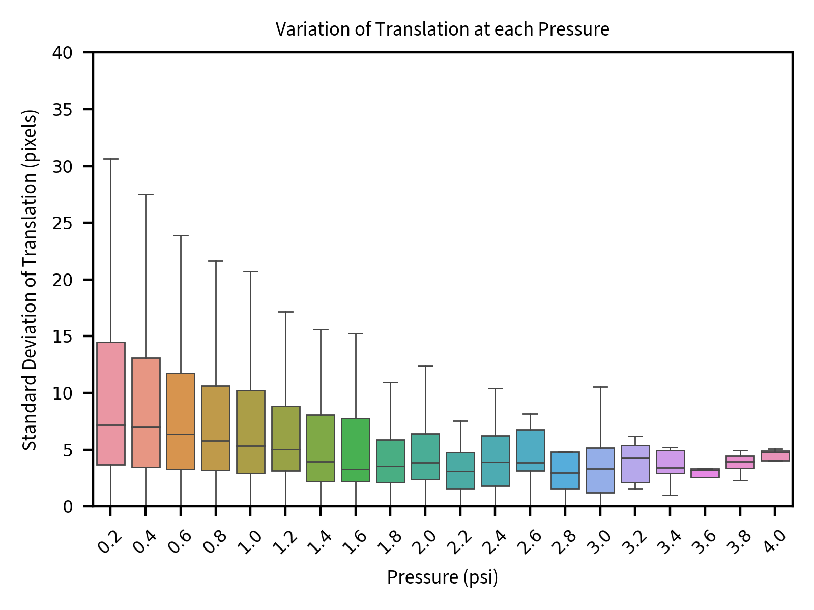

# Figure Generation for Capillary Flow Analysis

This document provides a detailed explanation of how the figures for the paper are generated using the Python scripts in this repository. Each section describes a specific analysis script, its purpose, how to use it, and how it contributes to the figures in the paper.

## Table of Contents

1. [Profile Calibration](#profile-calibration)
2. [Compare LEDs](#compare-leds)
3. [Compare Contrast](#compare-contrast)
4. [Image Processing](#image-processing) (To be completed)
5. [Velocity Analysis](#velocity-analysis) (To be completed)
6. [Flow Visualization](#flow-visualization) (To be completed)
7. [Statistical Analysis](#statistical-analysis) (To be completed)

## Profile Calibration

### Script: `src/analysis/profile_calibration.py`

#### Purpose
This script analyzes the intensity profiles along rows and columns of calibration images. It helps identify any non-uniformities in illumination or artifacts in the imaging system.

#### How to Use

1. **Input**: The script accepts a TIFF image file path. You can modify the path in the script:
   ```python
   image_path = 'path/to/your/calibration/image.tiff'
   ```

2. **Output**: The script generates a figure with two plots:
   - Row average profile (median intensity across each row)
   - Column average profile (median intensity across each column)
   
   The output is saved in the results directory with a timestamp:
   ```
   /results/calibration/profile_calibration_YYYYMMDD_HHMMSS.png
   ```

3. **Customization**:
   - Adjust the y-axis limits by modifying `ax1.set_ylim([200, 255])` and `ax2.set_ylim([200, 255])`
   - Modify figure dimensions with `figsize=(4.8, 2.0)`

#### Example Output


*Figure: Example output showing row and column intensity profiles from a calibration image. The plots reveal the uniformity of illumination across the field of view.*

#### Example Usage

```python
# To run with default parameters
python src/analysis/profile_calibration.py

# To use a different image, modify the image_path variable in the script
image_path = 'C:\\Users\\username\\data\\my_calibration_image.tiff'
```

#### Figure Output in Paper
This script generates figures showing the uniformity of illumination across the field of view, which is essential for validating the imaging system. In the paper, these figures are used in the Methods section to demonstrate the quality of the imaging setup.

## Compare LEDs

### Script: `src/analysis/compare_leds.py`

#### Purpose
This script provides tools for comparing images taken with different LED configurations, calculating various quality metrics, and analyzing line profiles to quantify differences in illumination.

#### Key Functions

1. **compare_images(image1, image2, plot=True)**
   - Compares two images using multiple metrics (MSE, RMSE, correlation, SSIM)
   - Optionally displays visualizations of the differences

2. **compare_line_profiles(profile1, profile2, plot=True)**
   - Compares two line profiles and calculates metrics like MSE, correlation, peak shift
   - Visualizes the profiles side by side

3. **analyze_image_quality(image1, image2, names=('Image 1', 'Image 2'), plot=True)**
   - Compares two images with a focus on contrast and quality metrics
   - Generates visualizations of intensity distributions and local contrast

4. **analyze_line_profile_quality(profile1, profile2, names=('Two LEDs', 'One LED'), plot=True)**
   - Compares two line profiles with a focus on signal quality and contrast
   - Calculates SNR, contrast, and FWHM for each profile
   - Generates a comparison visualization

#### Example Output



*Figure: Comparison of illumination profiles with different LED configurations. This visualization shows how the pressure affects translation in video analysis.*

#### How to Use

1. **Input**: The script works with grayscale images (typically TIFF files)

2. **Example Usage in main()**:
   ```python
   # Folder containing the images to compare
   image_folder = 'C:\\Users\\username\\data\\calibration\\led_comparison'
   
   # Load images
   image_paths = [os.path.join(image_folder, f) for f in os.listdir(image_folder)]
   image1 = cv2.imread(image_paths[0], cv2.IMREAD_GRAYSCALE)
   image2 = cv2.imread(image_paths[1], cv2.IMREAD_GRAYSCALE)
   
   # Compare line profiles
   profile1 = image1[574, :]  # Adjust row index as needed
   profile2 = image2[634, :]
   profile_quality = analyze_line_profile_quality(profile1, profile2)
   ```

3. **Output**: 
   - The script generates comparison plots saved to the results directory
   - Returns dictionaries with comparison metrics

#### Figure Output in Paper
This script generates figures comparing illumination profiles with different LED configurations. In the paper, these figures demonstrate how the illumination setup affects image quality and contrast. The SNR comparison is particularly important for validating the chosen LED configuration.

## Compare Contrast

### Script: `src/analysis/compare_contrast.py`

#### Purpose
This script analyzes and compares contrast metrics for microscope images. It's particularly useful for comparing images taken with different illumination colors (e.g., green vs. white).

#### Key Functions

1. **analyze_image_contrast(image_path)**
   - Calculates various contrast metrics for a single image:
     - Michelson contrast
     - RMS contrast
     - Weber contrast
     - Intensity range
     - Signal-to-noise ratio (SNR)

2. **compare_images(image_paths)**
   - Compares contrast metrics across multiple images

3. **plot_contrast_comparison(results)**
   - Creates bar charts for each metric across all images

4. **plot_contrast_comparison_together(image_paths)**
   - Creates a combined bar chart with normalized metrics for easier comparison

5. **plot_contrast_boxplots_color(results)**
   - Creates boxplots comparing green vs. white illumination for RMS and Weber contrast

#### Example Output


*Figure: Boxplots comparing RMS and Weber contrast metrics between green and white illumination. The plots demonstrate the superior contrast achieved with green illumination.*

#### How to Use

1. **Input**: The script works with image files (typically TIFF files)

2. **Example Usage**:
   ```python
   # Folder containing the images to compare
   image_folder = 'path/to/comparison/images'
   image_paths = [os.path.join(image_folder, f) for f in os.listdir(image_folder)]
   
   # Compare images
   results = compare_images(image_paths)
   
   # Create box plots comparing green vs. white illumination
   fig = plot_contrast_boxplots_color(results)
   plt.savefig('results/contrast_boxplots.png', dpi=400)
   ```

3. **Output**:
   - The script generates comparison plots saved to the results directory
   - Returns data structures with contrast metrics for each image

#### Figure Output in Paper
This script generates figures comparing contrast metrics between different illumination colors. In the paper, these boxplots demonstrate the quantitative differences in image quality achieved with green vs. white illumination, supporting the choice of optimal illumination for the experiments.

## Image Processing
(To be completed)

## Velocity Analysis
(To be completed)

## Flow Visualization
(To be completed)

## Statistical Analysis
(To be completed) 