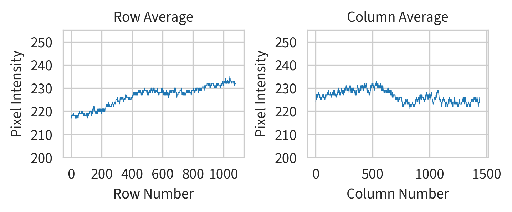
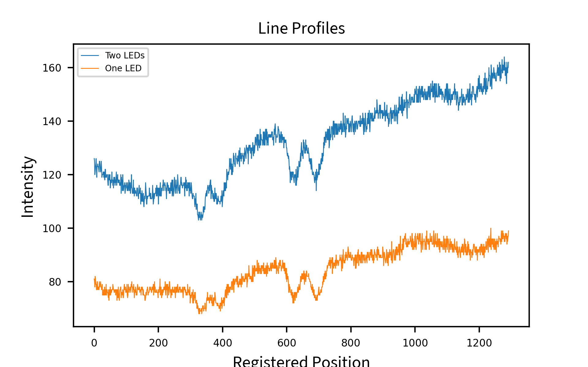
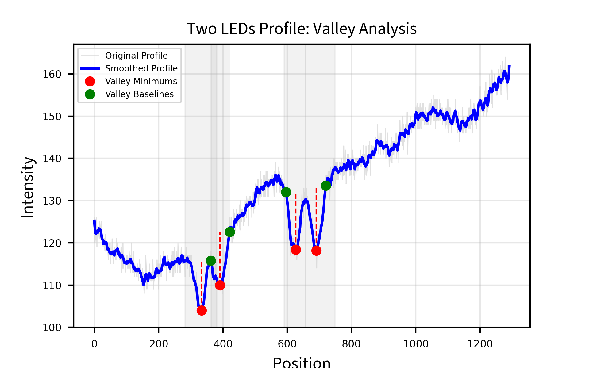
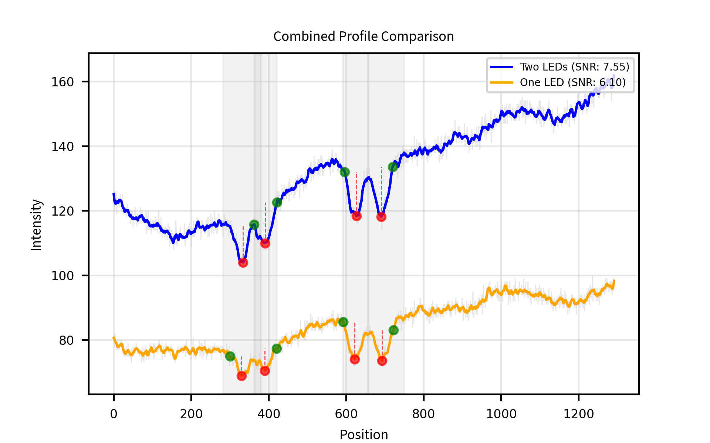
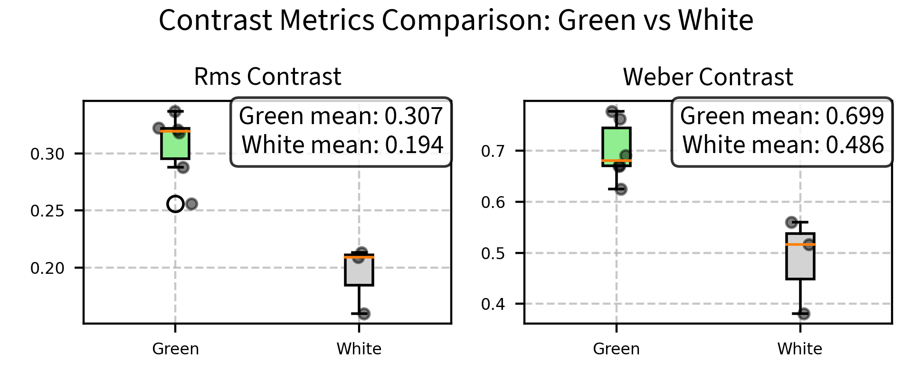

# Figure Generation for Capillary Flow Analysis

This document provides a detailed explanation of how the figures for the paper are generated using the Python scripts in this repository. Each section describes a specific analysis script, its purpose, how to use it, and how it contributes to the figures in the paper.

## Table of Contents

1. [Profile Calibration](#profile-calibration)
2. [Compare LEDs](#compare-leds)
3. [Valley-Based SNR Analysis](#valley-based-snr-analysis)
4. [Compare Contrast](#compare-contrast) 
5. [Resolution Line Profile](#resolution-line-profile)
6. [Image Processing](#image-processing) (To be completed)
7. [Velocity Analysis](#velocity-analysis) (To be completed)
8. [Flow Visualization](#flow-visualization) (To be completed)
9. [Statistical Analysis](#statistical-analysis) (To be completed)
10. [Velocity Validation](#velocity-validation)

## Profile Calibration

### Script: `src/analysis/profile_calibration.py`

#### Purpose
This script analyzes the intensity profiles along rows and columns of calibration images. It helps identify any non-uniformities in illumination or artifacts in the imaging system.

#### How to Use

1. **Input**: The script accepts a TIFF image file path. You can modify the path in the script:
   ```python
   image_path = 'path/to/your/calibration/image.tiff'
   ```

2. **Output**: The script generates a figure with two plots:
   - Row average profile (median intensity across each row)
   - Column average profile (median intensity across each column)
   
   The output is saved in the results directory with a timestamp:
   ```
   /results/calibration/profile_calibration_YYYYMMDD_HHMMSS.png
   ```

3. **Customization**:
   - Adjust the y-axis limits by modifying `ax1.set_ylim([200, 255])` and `ax2.set_ylim([200, 255])`
   - Modify figure dimensions with `figsize=(4.8, 2.0)`

#### Example Output



*Figure: Example output showing row and column intensity profiles from a calibration image. The plots reveal the uniformity of illumination across the field of view.*

#### Example Usage

```python
# To run with default parameters
python src/analysis/profile_calibration.py

# To use a different image, modify the image_path variable in the script
image_path = 'C:\\Users\\username\\data\\my_calibration_image.tiff'
```

#### Figure Output in Paper
This script generates figures showing the uniformity of illumination across the field of view, which is essential for validating the imaging system. In the paper, these figures are used in the Methods section to demonstrate the quality of the imaging setup.

## Compare LEDs

### Script: `src/analysis/compare_leds.py`

#### Purpose
This script provides tools for comparing images taken with different LED configurations, calculating various quality metrics, and analyzing line profiles to quantify differences in illumination.

#### Key Functions

1. **compare_images(image1, image2, plot=True)**
   - Compares two images using multiple metrics (MSE, RMSE, correlation, SSIM)
   - Optionally displays visualizations of the differences

2. **compare_line_profiles(profile1, profile2, plot=True)**
   - Compares two line profiles and calculates metrics like MSE, correlation, peak shift
   - Visualizes the profiles side by side

3. **analyze_image_quality(image1, image2, names=('Image 1', 'Image 2'), plot=True)**
   - Compares two images with a focus on contrast and quality metrics
   - Generates visualizations of intensity distributions and local contrast

4. **analyze_line_profile_quality(profile1, profile2, names=('Two LEDs', 'One LED'), plot=True)**
   - Compares two line profiles with a focus on signal quality and contrast
   - Calculates SNR, contrast, and FWHM for each profile
   - Generates a comparison visualization

5. **normalize_and_enhance_profiles(profile1, profile2, names=('Two LEDs', 'One LED'), plot=True)**
   - Normalizes line profiles and enhances contrast through histogram equalization
   - Displays both normalized and contrast-enhanced profiles
   - Helps visualize shape differences when intensity scales differ

6. **normalize_with_snr(profile1, profile2, names=('Two LEDs', 'One LED'), offset=0.2, plot=True)**
   - Normalizes line profiles for direct shape comparison
   - Applies a vertical offset to separate profiles for clearer visualization
   - Calculates and displays SNR and contrast metrics for each profile
   - Generates the normalized profile comparison shown below

#### Example Output



*Figure: Line profiles for one and two LED illumination setups. We pre-registered the profiles so the valleys (the capillaries) are at the same index values. These profiles are the inputs to the calculate_valley_snr function.*

#### How to Use

1. **Input**: The script works with grayscale images (typically TIFF files)

2. **Example Usage in main()**:
   ```python
   # Folder containing the images to compare
   image_folder = os.path.join(user_path, 'Desktop', 'data', 'calibration', '241213_led_sides')
   
   # Load images
   right_image_path = os.path.join(image_folder, 'rightpng.png')  # Single LED image
   both_image_path = os.path.join(image_folder, 'bothpng.png')    # Two LED image
   right_image = cv2.imread(right_image_path, cv2.IMREAD_GRAYSCALE)
   both_image = cv2.imread(both_image_path, cv2.IMREAD_GRAYSCALE)
   
   # Extract line profiles with same shape and 1D index
   profile1 = both_image[574, 74:-74]     # Two LED profile
   profile2 = right_image[634, 0:-148]    # One LED profile
   
   # Generate normalized profiles with SNR metrics
   simple_plot_profiles(profile1, profile2)
   ```

3. **Output**: 
   - The script generates comparison plots saved to the results directory


#### Figure Output in Paper
This script generates figures comparing illumination profiles with different LED configurations. In the paper, these figures demonstrate how the illumination setup affects image quality and contrast. 

## Valley-Based SNR Analysis

### Script: `src/analysis/compare_leds.py` (function: `calculate_valley_snr`)

#### Purpose
This script implements a specialized signal-to-noise ratio (SNR) analysis that focuses on detecting and measuring the depth of valleys in intensity profiles. By identifying these valleys (which correspond to capillaries in the microscope images) and comparing their depths to the background noise, we can quantitatively assess the quality of different illumination configurations.

#### Key Functions

1. **calculate_valley_snr(profile1, profile2, window_size=15, names=('Two LEDs', 'One LED'))**
   - Compares two profile signals by identifying valleys (local minima) in each
   - Calculates the depth of each valley relative to local baseline
   - Computes SNR as the ratio of valley depth to noise power
   - Generates detailed visualizations for each profile

2. **process_profile(profile, name)** (internal function)
   - Applies Savitzky-Golay filtering to smooth the profile
   - Identifies valleys using signal processing techniques
   - Uses regions of interest (ROIs) to target specific features
   - Calculates valley depths and SNR for each valley
   - Generates visualization showing valleys and measurements

#### Analysis Approach

The valley-based SNR method works in several steps:
1. **Signal Smoothing**: Applies a Savitzky-Golay filter to reduce noise while preserving signal features
2. **Noise Estimation**: Calculates residuals between the original and smoothed signals to estimate noise power
3. **Valley Detection**: Uses peak finding algorithms on the inverted signal to find valleys, with specific ROIs to focus on important features
4. **Baseline Determination**: For each valley, identifies local maximums on either side to serve as the baseline
5. **Valley Depth Calculation**: Measures the intensity difference between the valley minimum and its baseline
6. **SNR Calculation**: Divides valley depth by noise power to obtain SNR for each valley

#### Example Output



*Figure: Valley analysis for a two LED profile showing detected valleys (red dots), valley baselines (green dots), and measurement lines. The regions of interest are highlighted with gray bands. The analysis quantifies the depth and SNR of each valley, providing metrics to compare illumination quality.*


*Figure: Valley analysis for both profiles*

#### How to Use

```python
# Load line profiles from images (pre-register to be same shape and have same index)
profile1 = both_image[574, 74:-74]  # Two LED profile
profile2 = right_image[634, 0:-148]  # One LED profile

# Calculate SNR using valley method
valley_results1, valley_results2 = calculate_valley_snr(profile1, profile2, window_size=15)

# Print results for valley analysis
print(valley_results1)
print(valley_results2)
```

#### Output
The function returns a dictionary with the following metrics for each profile:
- Valley positions
- Valley depths
- Valley SNR values
- Noise power estimate
- Mean valley depth
- Mean valley SNR

#### Figure Output in Paper
This analysis generates figures that visualize the valleys in intensity profiles with different illumination configurations. In the paper, these figures demonstrate how the two LED configuration provides deeper valleys and higher SNR compared to the single LED configuration, quantifying the improved contrast of capillaries in the images.

## Compare Contrast

### Script: `src/analysis/compare_contrast.py`

#### Purpose
This script analyzes and compares contrast metrics for microscope images. It's particularly useful for comparing images taken with different illumination colors (e.g., green vs. white).

#### Key Functions

1. **analyze_image_contrast(image_path)**
   - Calculates various contrast metrics for a single image:
     - Michelson contrast
     - RMS contrast
     - Weber contrast
     - Intensity range
     - Signal-to-noise ratio (SNR)

2. **compare_images(image_paths)**
   - Compares contrast metrics across multiple images

3. **plot_contrast_comparison(results)**
   - Creates bar charts for each metric across all images

4. **plot_contrast_comparison_together(image_paths)**
   - Creates a combined bar chart with normalized metrics for easier comparison

5. **plot_contrast_boxplots_color(results)**
   - Creates boxplots comparing green vs. white illumination for RMS and Weber contrast

#### Example Output



*Figure: Boxplots comparing RMS and Weber contrast metrics between green and white illumination. The plots demonstrate the superior contrast achieved with green illumination.*

#### How to Use

1. **Input**: The script works with image files (typically TIFF files)

2. **Example Usage**:
   ```python
   # Folder containing the images to compare
   image_folder = 'path/to/comparison/images'
   image_paths = [os.path.join(image_folder, f) for f in os.listdir(image_folder)]
   
   # Compare images
   results = compare_images(image_paths)
   
   # Create box plots comparing green vs. white illumination
   fig = plot_contrast_boxplots_color(results)
   plt.savefig('results/contrast_boxplots.png', dpi=400)
   ```

3. **Output**:
   - The script generates comparison plots saved to the results directory
   - Returns data structures with contrast metrics for each image

#### Figure Output in Paper
This script generates figures comparing contrast metrics between different illumination colors. In the paper, these boxplots demonstrate the quantitative differences in image quality achieved with green vs. white illumination, supporting the choice of optimal illumination for the experiments.

## Resolution Line Profile

### Script: `src/analysis/resolution_line_profile.py`

#### Purpose
This script analyzes the resolution of our microscope system by examining intensity profiles from the USAF 1951 resolution target. By measuring how sharply the system can resolve line pairs in the target, we can quantify the spatial resolution of our optical setup.

#### Key Functions

1. **setup_plot_style()**
   - Configures plot styling according to coding standards
   - Sets up whitegrid style, font sizes, and line widths
   - Handles the loading of custom fonts with fallback options

2. **analyze_resolution_profile(image_path, profile_row, profile_col_start, profile_col_end, save, show)**
   - Loads a grayscale image of the resolution target
   - Extracts an intensity profile along a row at specified column range
   - Creates a standardized plot showing the intensity transitions between light and dark bars
   - Calculates and displays the profile with proper labeling
   - Saves the output figure with timestamp in standardized format

#### Analysis Approach

The resolution line profile analysis works as follows:
1. **Target Selection**: The USAF 1951 resolution target provides standardized line pairs at different spatial frequencies
2. **Profile Extraction**: A line profile is extracted across a group of line pairs on the target
3. **Contrast Analysis**: The depth of intensity modulation between light and dark bars indicates resolution quality
4. **Resolution Calculation**: The smallest line pairs that show clear intensity peaks and valleys define the resolving power

#### Example Output


*Figure: Resolution line profile showing intensity variations across line pairs in the USAF 1951 resolution target. Sharper transitions between peaks and valleys indicate better spatial resolution. From this profile, we can determine that our system resolves Group 7 Element 6 of the target, corresponding to a resolution of approximately 2.2 μm.*

#### How to Use

```python
# Import the function
from src.analysis.resolution_line_profile import analyze_resolution_profile

# Path to the resolution target image
image_path = os.path.join(downloads_path, "Image__2024-05-22__09-28-06.tiff")

# Analyze with default parameters (specific row and column range for the target)
profile, fig = analyze_resolution_profile(
    image_path,
    profile_row=566,
    profile_col_start=600,
    profile_col_end=615,
    save=True,
    show=True
)

# Alternatively, find the resolution at a different location on the target
profile2, fig2 = analyze_resolution_profile(
    image_path,
    profile_row=400,  # Different row location
    profile_col_start=500,
    profile_col_end=530,
    save=True,
    show=True
)
```

#### Resolution Calculation

To calculate the actual spatial resolution from the profile, we use the following approach:
1. Identify which group and element on the USAF target is barely resolvable
2. Use the standard formula to convert group/element to resolution:
   - Resolution (line pairs/mm) = 2^(group + (element-1)/6) * 2
   - Resolution (μm) = 1000 / (line pairs/mm)

For our system viewing Group 7 Element 6:
- Line pairs/mm = 2^(7 + (6-1)/6) * 2 = 228.1 lp/mm
- Resolution = 1000 / 228.1 = 4.38 μm (for a line pair)
- Minimum resolvable feature = 4.38 / 2 = 2.19 μm

#### Figure Output in Paper
This analysis generates figures showing the resolution capabilities of our microscope system. In the paper, these figures demonstrate that our setup can resolve features down to approximately 2.2 μm, which is sufficient for visualizing and measuring the smallest capillaries in our samples (typically 5-10 μm in diameter).

## Image Processing
(To be completed)

## Velocity Analysis
(To be completed)

## Flow Visualization
(To be completed)

## Statistical Analysis
(To be completed)

## Velocity Validation

### Script: `scripts/gui_kymos.py`

#### Purpose
This script provides a graphical user interface for manual validation of velocities from kymographs, which are time-space images used to measure blood flow velocities in capillaries. The tool allows users to visually assess the accuracy of automatically detected velocities and adjust them if necessary.

#### Key Functions

1. **KymographClassifier class**
   - Loads kymograph images and associated velocity data
   - Displays kymographs with overlaid velocity reference lines
   - Provides interface for classifying and adjusting velocities

2. **Classification Workflow**
   - Initial classification of each kymograph as "Correct," "Too Fast," "Too Slow," "Zero," or "Unclear"
   - For "Too Fast" or "Too Slow" classifications, selection of an alternative velocity from predefined sets
   - Navigation through unclassified kymographs with progress tracking

3. **Velocity Adjustment System**
   - Two velocity sets accessible via Shift key toggle:
     - High velocities (10, 420, 500, 600, 750, 1000, 1500, 2000, 3000, 4000 μm/s)
     - Additional velocities (10, 20, 35, 50, 75, 110, 160, 220, 290, 360 μm/s)
   - Dynamic overlay of velocity reference lines based on selected velocity
   - Slope inversion option for handling bidirectional flows

4. **Data Management**
   - Real-time saving of classification results to CSV
   - Loading of relevant metadata (e.g., FPS) for accurate velocity calculations
   - Tracking of classification decisions for quality control

#### How to Use

1. **Input**: 
   - Directory containing kymograph TIFF images
   - Metadata directory with acquisition parameters
   - CSV file with initial velocity measurements
   - Output path for classification results

2. **Example Usage**:
   ```python
   classifier = KymographClassifier(
       'path/to/kymographs',
       'path/to/metadata',
       'path/to/velocity_measurements.csv',
       'path/to/output_classifications.csv'
   )
   ```

3. **Keyboard Controls**:
   - `c`: Mark kymograph as correct or accept current velocity
   - `f`: Mark original velocity as too fast
   - `s`: Mark original velocity as too slow
   - `z`: Mark as zero flow
   - `u`: Mark as unclear
   - `p`: Toggle slope direction
   - `n`: Next kymograph
   - `b`: Previous kymograph
   - `Shift`: Toggle between velocity sets
   - `0-9`: Select velocity from current set

4. **Output**:
   - CSV file with original velocities, classifications, and adjusted velocities

#### Figure Output in Paper
This tool generates the dataset used for analyzing the accuracy of automated velocity measurements. The classifications and adjusted velocities are used in figures comparing automated and manual measurements, demonstrating the reliability of the velocity detection algorithms and identifying systematic biases or limitations.

[Figure placeholder: Example kymograph with velocity overlay and classification interface] 