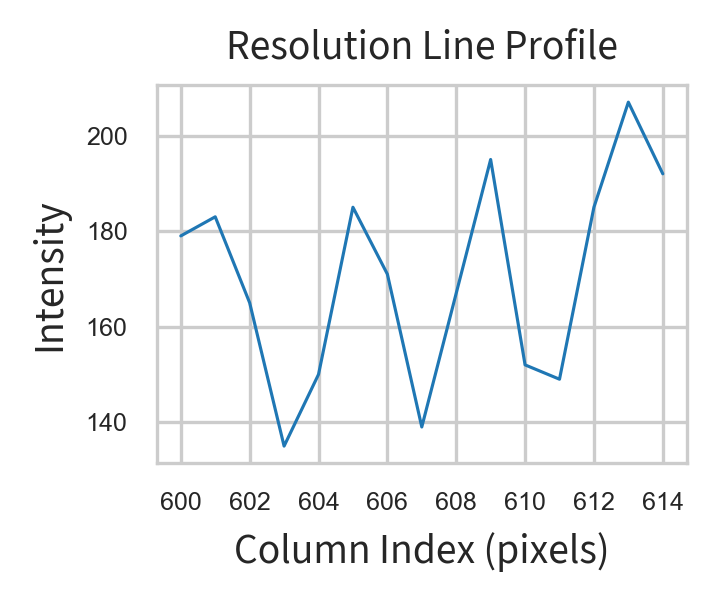

# Figure Generation for Capillary Flow Analysis

This document provides a detailed explanation of how the figures for the paper are generated using the Python scripts in this repository. Each section describes a specific analysis script, its purpose, how to use it, and how it contributes to the figures in the paper. Go to the [Image Processing and Velocity Extraction](#image-processing-and-velocity-extraction) section for the data processing pipeline. 

## Table of Contents

Figures and Supplemental Figures:
1. [Profile Calibration](#profile-calibration)
2. [Compare LEDs](#compare-leds)
3. [Valley-Based SNR Analysis](#valley-based-snr-analysis)
4. [Compare Contrast](#compare-contrast) 
5. [Resolution Line Profile](#resolution-line-profile)
Data Pipeline
6. [Image Processing and Velocity Extraction](#image-processing-and-velocity-extraction) 
7. [Velocity Analysis](#velocity-analysis) (To be completed)
8. [Flow Visualization](#flow-visualization) (To be completed)
9. [Statistical Analysis](#statistical-analysis) (To be completed)
10. [Velocity Validation](#velocity-validation)

## Profile Calibration

### Script: `src/analysis/profile_calibration.py`

#### Purpose
This script analyzes the intensity profiles along rows and columns of calibration images. It helps identify any non-uniformities in illumination or artifacts in the imaging system.

#### How to Use

1. **Input**: The script accepts a TIFF image file path. You can modify the path in the script:
   ```python
   image_path = 'path/to/your/calibration/image.tiff'
   ```

2. **Output**: The script generates a figure with two plots:
   - Row average profile (median intensity across each row)
   - Column average profile (median intensity across each column)
   
   The output is saved in the results directory with a timestamp:
   ```
   /results/calibration/profile_calibration_YYYYMMDD_HHMMSS.png
   ```

3. **Customization**:
   - Adjust the y-axis limits by modifying `ax1.set_ylim([200, 255])` and `ax2.set_ylim([200, 255])`
   - Modify figure dimensions with `figsize=(4.8, 2.0)`

#### Example Output


*Figure: Example output showing row and column intensity profiles from a calibration image. The plots reveal the uniformity of illumination across the field of view.*

#### Example Usage

```python
# To run with default parameters
python src/analysis/profile_calibration.py

# To use a different image, modify the image_path variable in the script
image_path = 'C:\\Users\\username\\data\\my_calibration_image.tiff'
```

#### Figure Output in Paper
This script generates figures showing the uniformity of illumination across the field of view, which is essential for validating the imaging system. In the paper, these figures are used in the Methods section to demonstrate the quality of the imaging setup.

## Compare LEDs

### Script: `src/analysis/compare_leds.py`

#### Purpose
This script provides tools for comparing images taken with different LED configurations, calculating various quality metrics, and analyzing line profiles to quantify differences in illumination.

#### Key Functions

1. **compare_images(image1, image2, plot=True)**
   - Compares two images using multiple metrics (MSE, RMSE, correlation, SSIM)
   - Optionally displays visualizations of the differences

2. **compare_line_profiles(profile1, profile2, plot=True)**
   - Compares two line profiles and calculates metrics like MSE, correlation, peak shift
   - Visualizes the profiles side by side

3. **analyze_image_quality(image1, image2, names=('Image 1', 'Image 2'), plot=True)**
   - Compares two images with a focus on contrast and quality metrics
   - Generates visualizations of intensity distributions and local contrast

4. **analyze_line_profile_quality(profile1, profile2, names=('Two LEDs', 'One LED'), plot=True)**
   - Compares two line profiles with a focus on signal quality and contrast
   - Calculates SNR, contrast, and FWHM for each profile
   - Generates a comparison visualization

5. **normalize_and_enhance_profiles(profile1, profile2, names=('Two LEDs', 'One LED'), plot=True)**
   - Normalizes line profiles and enhances contrast through histogram equalization
   - Displays both normalized and contrast-enhanced profiles
   - Helps visualize shape differences when intensity scales differ

6. **normalize_with_snr(profile1, profile2, names=('Two LEDs', 'One LED'), offset=0.2, plot=True)**
   - Normalizes line profiles for direct shape comparison
   - Applies a vertical offset to separate profiles for clearer visualization
   - Calculates and displays SNR and contrast metrics for each profile
   - Generates the normalized profile comparison shown below

#### Example Output


*Figure: Line profiles for one and two LED illumination setups. We pre-registered the profiles so the valleys (the capillaries) are at the same index values. These profiles are the inputs to the calculate_valley_snr function.*

#### How to Use

1. **Input**: The script works with grayscale images (typically TIFF files)

2. **Example Usage in main()**:
   ```python
   # Folder containing the images to compare
   image_folder = os.path.join(user_path, 'Desktop', 'data', 'calibration', '241213_led_sides')
   
   # Load images
   right_image_path = os.path.join(image_folder, 'rightpng.png')  # Single LED image
   both_image_path = os.path.join(image_folder, 'bothpng.png')    # Two LED image
   right_image = cv2.imread(right_image_path, cv2.IMREAD_GRAYSCALE)
   both_image = cv2.imread(both_image_path, cv2.IMREAD_GRAYSCALE)
   
   # Extract line profiles with same shape and 1D index
   profile1 = both_image[574, 74:-74]     # Two LED profile
   profile2 = right_image[634, 0:-148]    # One LED profile
   
   # Generate normalized profiles with SNR metrics
   simple_plot_profiles(profile1, profile2)
   ```

3. **Output**: 
   - The script generates comparison plots saved to the results directory


#### Figure Output in Paper
This script generates figures comparing illumination profiles with different LED configurations. In the paper, these figures demonstrate how the illumination setup affects image quality and contrast. 

## Valley-Based SNR Analysis

### Script: `src/analysis/compare_leds.py` (function: `calculate_valley_snr`)

#### Purpose
This script implements a specialized signal-to-noise ratio (SNR) analysis that focuses on detecting and measuring the depth of valleys in intensity profiles. By identifying these valleys (which correspond to capillaries in the microscope images) and comparing their depths to the background noise, we can quantitatively assess the quality of different illumination configurations.

#### Key Functions

1. **calculate_valley_snr(profile1, profile2, window_size=15, names=('Two LEDs', 'One LED'))**
   - Compares two profile signals by identifying valleys (local minima) in each
   - Calculates the depth of each valley relative to local baseline
   - Computes SNR as the ratio of valley depth to noise power
   - Generates detailed visualizations for each profile

2. **process_profile(profile, name)** (internal function)
   - Applies Savitzky-Golay filtering to smooth the profile
   - Identifies valleys using signal processing techniques
   - Uses regions of interest (ROIs) to target specific features
   - Calculates valley depths and SNR for each valley
   - Generates visualization showing valleys and measurements

#### Analysis Approach

The valley-based SNR method works in several steps:
1. **Signal Smoothing**: Applies a Savitzky-Golay filter to reduce noise while preserving signal features
2. **Noise Estimation**: Calculates residuals between the original and smoothed signals to estimate noise power
3. **Valley Detection**: Uses peak finding algorithms on the inverted signal to find valleys, with specific ROIs to focus on important features
4. **Baseline Determination**: For each valley, identifies local maximums on either side to serve as the baseline
5. **Valley Depth Calculation**: Measures the intensity difference between the valley minimum and its baseline
6. **SNR Calculation**: Divides valley depth by noise power to obtain SNR for each valley

#### Example Output


*Figure: Valley analysis for a two LED profile showing detected valleys (red dots), valley baselines (green dots), and measurement lines. The regions of interest are highlighted with gray bands. The analysis quantifies the depth and SNR of each valley, providing metrics to compare illumination quality.*


*Figure: Valley analysis for both profiles*

#### How to Use

```python
# Load line profiles from images (pre-register to be same shape and have same index)
profile1 = both_image[574, 74:-74]  # Two LED profile
profile2 = right_image[634, 0:-148]  # One LED profile

# Calculate SNR using valley method
valley_results1, valley_results2 = calculate_valley_snr(profile1, profile2, window_size=15)

# Print results for valley analysis
print(valley_results1)
print(valley_results2)
```

#### Output
The function returns a dictionary with the following metrics for each profile:
- Valley positions
- Valley depths
- Valley SNR values
- Noise power estimate
- Mean valley depth
- Mean valley SNR

#### Figure Output in Paper
This analysis generates figures that visualize the valleys in intensity profiles with different illumination configurations. In the paper, these figures demonstrate how the two LED configuration provides deeper valleys and higher SNR compared to the single LED configuration, quantifying the improved contrast of capillaries in the images.

## Compare Contrast

### Script: `src/analysis/compare_contrast.py`

#### Purpose
This script analyzes and compares contrast metrics for microscope images. It's particularly useful for comparing images taken with different illumination colors (e.g., green vs. white).

#### Key Functions

1. **analyze_image_contrast(image_path)**
   - Calculates various contrast metrics for a single image:
     - Michelson contrast
     - RMS contrast
     - Weber contrast
     - Intensity range
     - Signal-to-noise ratio (SNR)

2. **compare_images(image_paths)**
   - Compares contrast metrics across multiple images

3. **plot_contrast_comparison(results)**
   - Creates bar charts for each metric across all images

4. **plot_contrast_comparison_together(image_paths)**
   - Creates a combined bar chart with normalized metrics for easier comparison

5. **plot_contrast_boxplots_color(results)**
   - Creates boxplots comparing green vs. white illumination for RMS and Weber contrast

#### Example Output


*Figure: Boxplots comparing RMS and Weber contrast metrics between green and white illumination. The plots demonstrate the superior contrast achieved with green illumination.*

#### How to Use

1. **Input**: The script works with image files (typically TIFF files)

2. **Example Usage**:
   ```python
   # Folder containing the images to compare
   image_folder = 'path/to/comparison/images'
   image_paths = [os.path.join(image_folder, f) for f in os.listdir(image_folder)]
   
   # Compare images
   results = compare_images(image_paths)
   
   # Create box plots comparing green vs. white illumination
   fig = plot_contrast_boxplots_color(results)
   plt.savefig('results/contrast_boxplots.png', dpi=400)
   ```

3. **Output**:
   - The script generates comparison plots saved to the results directory
   - Returns data structures with contrast metrics for each image

#### Figure Output in Paper
This script generates figures comparing contrast metrics between different illumination colors. In the paper, these boxplots demonstrate the quantitative differences in image quality achieved with green vs. white illumination, supporting the choice of optimal illumination for the experiments.

## Resolution Line Profile

### Script: `src/analysis/resolution_line_profile.py`

#### Purpose
This script analyzes the resolution of our microscope system by examining intensity profiles from the USAF 1951 resolution target. By measuring how sharply the system can resolve line pairs in the target, we can quantify the spatial resolution of our optical setup.

#### Key Functions

1. **setup_plot_style()**
   - Configures plot styling according to coding standards
   - Sets up whitegrid style, font sizes, and line widths
   - Handles the loading of custom fonts with fallback options

2. **analyze_resolution_profile(image_path, profile_row, profile_col_start, profile_col_end, save, show)**
   - Loads a grayscale image of the resolution target
   - Extracts an intensity profile along a row at specified column range
   - Creates a standardized plot showing the intensity transitions between light and dark bars
   - Calculates and displays the profile with proper labeling
   - Saves the output figure with timestamp in standardized format

#### Analysis Approach

The resolution line profile analysis works as follows:
1. **Target Selection**: The USAF 1951 resolution target provides standardized line pairs at different spatial frequencies
2. **Profile Extraction**: A line profile is extracted across a group of line pairs on the target
3. **Contrast Analysis**: The depth of intensity modulation between light and dark bars indicates resolution quality
4. **Resolution Calculation**: The smallest line pairs that show clear intensity peaks and valleys define the resolving power

#### Example Output



*Figure: Resolution line profile showing intensity variations across line pairs in the USAF 1951 resolution target. Sharper transitions between peaks and valleys indicate better spatial resolution. From this profile, we can determine that our system resolves Group 7 Element 6 of the target, corresponding to a resolution of approximately 2.2 μm.*

#### How to Use

```python
# Import the function
from src.analysis.resolution_line_profile import analyze_resolution_profile

# Path to the resolution target image
image_path = os.path.join(downloads_path, "Image__2024-05-22__09-28-06.tiff")

# Analyze with default parameters (specific row and column range for the target)
profile, fig = analyze_resolution_profile(
    image_path,
    profile_row=566,
    profile_col_start=600,
    profile_col_end=615,
    save=True,
    show=True
)

# Alternatively, find the resolution at a different location on the target
profile2, fig2 = analyze_resolution_profile(
    image_path,
    profile_row=400,  # Different row location
    profile_col_start=500,
    profile_col_end=530,
    save=True,
    show=True
)
```

#### Resolution Calculation

To calculate the actual spatial resolution from the profile, we use the following approach:
1. Identify which group and element on the USAF target is barely resolvable
2. Use the standard formula to convert group/element to resolution:
   - Resolution (line pairs/mm) = 2^(group + (element-1)/6) * 2
   - Resolution (μm) = 1000 / (line pairs/mm)

For our system viewing Group 7 Element 6:
- Line pairs/mm = 2^(7 + (6-1)/6) * 2 = 228.1 lp/mm
- Resolution = 1000 / 228.1 = 4.38 μm (for a line pair)
- Minimum resolvable feature = 4.38 / 2 = 2.19 μm

#### Figure Output in Paper
This analysis generates figures showing the resolution capabilities of our microscope system. In the paper, these figures demonstrate that our setup can resolve features down to approximately 2.2 μm, which is sufficient for visualizing and measuring the smallest capillaries in our samples (typically 5-10 μm in diameter).

## Image Processing and Velocity extraction
## Capillary Contrast Enhancement

### Script: `src/capillary_contrast.py`

#### Purpose
This script automatically enhances the contrast of capillary images by applying histogram-based contrast adjustment. It processes a series of images without requiring manual checking, improving the visibility of capillaries in the microscope images.

#### Key Functions

1. **calculate_histogram_cutoffs(histogram, total_pixels, saturated_percentage)**
   - Calculates optimal cutoff values for contrast stretching based on a specified saturation percentage
   - Finds the points in the histogram that exclude the specified percentage of pixels from both ends

2. **apply_contrast(image, lower_cutoff, upper_cutoff, hist_size=256)**
   - Applies the contrast adjustment to an image using a lookup table (LUT)
   - Maps intensity values below the lower cutoff to 0 (black)
   - Maps intensity values above the upper cutoff to 255 (white)
   - Linearly scales values in between for maximum contrast

3. **capillary_contrast(input_folder, output_folder, saturated_percentage=0.85, plot=False)**
   - Main function that processes all images in the input folder
   - Uses the first image to calculate histogram cutoffs, then applies them to all images
   - Saves the processed images to the output folder
   - Optionally displays a before/after comparison plot

#### How to Use

```python
# Process all images in the specified folder
input_folder = "path/to/moco/images"
output_folder = "path/to/output/folder"
capillary_contrast(input_folder, output_folder, saturated_percentage=0.85)

# To view before/after comparison
capillary_contrast(input_folder, output_folder, plot=True)
```

#### Image Processing Approach

The contrast enhancement works by:
1. Computing the histogram of pixel intensities in the first image
2. Finding cutoff points that exclude a small percentage (default 0.85%) of the darkest and brightest pixels
3. Stretching the remaining intensity range to use the full 0-255 range
4. Applying the same transformation to all images in the sequence for consistency

#### Figure Output in Pipeline
This script is typically the first step in the capillary analysis pipeline. It enhances the visibility of capillaries in the microscope images, making subsequent segmentation and analysis more accurate. The contrast-enhanced images aren't directly used as figures in the paper but serve as improved inputs for later processing steps.

## Background Generation

### Script: `src/write_background_file.py`

#### Purpose
This script generates background images from stabilized video sequences of capillaries. By averaging or taking the median of all frames in a video, it creates a static background image that represents the non-moving structures. This background is essential for later segmentation and analysis steps.

#### Key Functions

1. **main(path, method="mean", make_video=True, color=False, verbose=False, plot=False)**
   - Creates a background image from a series of stabilized frames
   - Can use either "mean" or "median" methods for background generation
   - Optionally produces a video of the stabilized frames
   - Generates both background and standard deviation images

#### Processing Approach

The background generation works through these steps:
1. **Input Selection**: Identifies the appropriate stabilized image folder (moco, mocoslice, or mocosplit)
2. **Frame Loading**: Reads all frames from the stabilized video
3. **Frame Cropping**: Uses shift values from stabilization metadata to crop frames to a consistent size
4. **Background Calculation**: Computes either the mean or median value for each pixel across all frames
5. **Standard Deviation Calculation**: Computes pixel-wise standard deviation across frames to identify areas with movement
6. **Output**: Saves the background image and contrast-enhanced standard deviation image

#### Example Usage

```python
# Generate background using median method
path = 'path/to/video/folder'
write_background_file.main(path, method="median", make_video=False)

# Generate background and create a video of the stabilized frames
write_background_file.main(path, method="mean", make_video=True, color=False)
```

#### Output Files

1. **Background Image**: A TIFF file representing the static background (named `prefix_video_background.tiff`)
2. **Standard Deviation Image**: A contrast-enhanced visualization of pixel variation over time (named `prefix_video_stdev.tiff`)
3. **Stabilized Video** (optional): An AVI file showing the stabilized frames

#### Figure Output in Pipeline
The background images serve as essential inputs for capillary segmentation. The standard deviation images can be used as figures in the paper to demonstrate regions of blood flow activity. Areas with high standard deviation correspond to regions with movement (active blood flow), while low standard deviation indicates static tissue.

## Capillary Naming

### Script: `scripts/cap_name_pipeline2.py` and `src/name_capillaries.py`

#### Purpose
This script orchestrates the capillary naming process across multiple participant datasets. It uses the `name_capillaries` module to identify and label individual capillaries in segmented images, creating a consistent naming scheme for further analysis.

#### Key Functions in `cap_name_pipeline2.py`

1. **main()**
   - Processes data for a participant specified via command-line argument
   - Finds the earliest date directory for the participant
   - Loops through all location folders
   - Runs the `name_capillaries.main()` function on each location

#### Key Functions in `src/name_capillaries.py`

1. **uncrop_segmented(video_path, input_seg_img)**
   - Reverses the cropping that was applied during motion correction
   - Uses shift data from the stabilization algorithm's CSV output
   - Pads the segmented image to match the original frame dimensions
   - Returns the uncropped image and the gap values for alignment reference

2. **create_capillary_masks(binary_mask)**
   - Takes a binary segmentation mask containing multiple capillaries
   - Uses connected component labeling to identify individual capillaries
   - Returns a list of separate binary masks, one for each capillary

3. **create_overlay_with_label(frame_img, cap_mask, color, label)**
   - Overlays a colored capillary mask onto a background image
   - Applies transparency for better visualization
   - Finds the centroid of the capillary for label placement
   - Adds a readable text label with black outline and white fill

4. **main(location_path)**
   - Loads segmented images and corresponding background images
   - Uncrops segmented images to original video dimensions
   - Creates individual masks for each capillary using connected component analysis
   - Assigns a sequential number to each capillary
   - Creates CSV files mapping original filenames to capillary identifiers
   - Saves individual capillary masks as separate files
   - Generates color-coded overlay visualizations of all capillaries

#### Processing Pipeline Detail

1. **Segmentation Processing**:
   - Loads segmented binary masks from the hasty.ai segmentation output
   - Normalizes the segmentation masks to binary values (0 or 255)
   - Uncrops the masks to match original video dimensions using shift data

2. **Capillary Isolation**:
   - The `create_capillary_masks()` function uses scikit-image's `label()` function to identify connected regions
   - Each connected region (representing a single capillary) is extracted as a separate binary mask
   - Masks are numbered sequentially (00, 01, 02, etc.) based on the order they were found

3. **Overlay Creation**:
   - Generates a color-coded visualization where each capillary is shown in a different color
   - Uses matplotlib's tab20 colormap to ensure visually distinct colors
   - Overlays the colored masks onto the background image with transparency
   - Labels each capillary with its assigned number

4. **Data Organization**:
   - Creates a CSV mapping structure with "File Name" and "Capillary Name" columns
   - Initially, "Capillary Name" is left empty for manual assignment later
   - Saves individual capillary masks in dedicated directories for further processing
   - Stores CSV files both in the local data directory and in a centralized results location

#### Example Output Files

1. **Individual Capillary Masks**: 
   - Named according to the pattern: `prefix_video_seg_cap_XX.png`
   - Stored in `segmented/hasty/individual_caps_original/`

2. **Naming CSV**:
   - Contains mapping between auto-generated filenames and capillary identifiers
   - Named according to the pattern: `participant_date_location_cap_names.csv`
   - Stored both locally and in the results directory

3. **Overlay Visualizations**:
   - Color-coded visualizations of all detected capillaries with labels
   - Named according to the pattern: `prefix_video_overlay.png`
   - Stored in `segmented/hasty/overlays/`

#### Figure Output in Pipeline
This naming process establishes a consistent identification system for tracking specific capillaries across multiple videos and conditions. The overlay images serve as visual references, enabling researchers to identify specific capillaries in the original videos and correlate them with their assigned identifiers in the dataset.

## Capillary Renaming

### Script: `scripts/cap_rename_pipeline2.py` and `src/rename_capillaries.py`

#### Purpose
These scripts handle the renaming of capillaries after manual review and annotation. Once capillaries have been initially identified and mapped, researchers manually update the naming CSV files to assign consistent identifiers to the same capillaries across different videos. The renaming process then applies these identifiers and generates updated visualizations.

#### Key Functions in `cap_rename_pipeline2.py`

1. **main()**
   - Processes data for a participant specified via command-line argument
   - Finds the earliest date directory for the participant
   - Loops through all location folders
   - Runs the `rename_capillaries()` and `create_renamed_overlays()` functions

#### Key Functions in `src/rename_capillaries.py`

1. **rename_capillaries(location_path)**
   - Reads the manually updated CSV files with capillary name assignments
   - Iterates through each capillary entry in the CSV
   - Creates copies of capillary mask files with updated naming
   - Preserves original filenames for capillaries without manual name assignments
   - Handles edge cases like missing files and ensures zero-padding for consistent naming

2. **create_renamed_overlays(location_path)**
   - Groups renamed capillary files by their base name for processing
   - Loads the background image for each video
   - Creates a new overlay visualization with the updated capillary names
   - Uses the same color scheme and layout as the original overlays for consistency
   - Saves the updated visualizations in the renamed_overlays directory

3. **create_overlay_with_label(frame_img, cap_mask, color, label)**
   - Same function used in the initial naming process
   - Creates a transparent, colored overlay with the capillary's assigned identifier
   - Ensures visibility by using black outline and white fill for text

#### Manual Annotation Process

Between the naming and renaming steps, researchers perform a critical manual annotation:

1. Researchers examine the initial overlay visualizations
2. They identify the same capillaries across multiple videos
3. They update the CSV files, assigning consistent numbers to the same capillaries
4. For example, a capillary initially labeled "00" might be renamed to "05" to match its identifier in other videos

#### Renaming Implementation Detail

1. **CSV Processing**:
   - The renaming process reads the manually updated CSV files
   - Each row maps an original capillary filename to its new identifier
   - If a new identifier is provided, it's used to create a new filename
   - If no new identifier is provided, the original filename is preserved

2. **File Management**:
   - New copies of the capillary mask files are created with updated names
   - Original files are preserved to maintain the full processing history
   - The new files are stored in the `renamed_individual_caps_original` directory

3. **Visualization Update**:
   - New overlays are created showing the renamed capillaries
   - These use the same visual styling as the original overlays but with updated labels
   - The overlays help verify that the renaming process was performed correctly

#### Output Files

1. **Renamed Capillary Masks**:
   - Named according to the pattern: `prefix_video_seg_cap_XX.png` (where XX is the manually assigned identifier)
   - Stored in `segmented/hasty/renamed_individual_caps_original/`

2. **Renamed Overlay Visualizations**:
   - Updated color-coded visualizations showing the manually assigned capillary names
   - Named according to the pattern: `prefix_video_renamed_overlay.png`
   - Stored in `segmented/hasty/renamed_overlays/`

#### Figure Output in Pipeline
The renamed overlay visualizations serve as key reference figures for all subsequent analyses. They allow researchers to:
1. Visually verify that the same capillaries have been consistently identified across multiple videos
2. Reference specific capillaries by their assigned identifiers in discussions and publications
3. Track changes in specific capillaries under different physiological conditions
4. Ensure that comparative analyses (e.g., velocity changes) are performed on the same capillaries

These consistent identifiers are essential for the validity of longitudinal and comparative analyses across different videos and conditions.

## Centerline Detection

### Script: `src/find_centerline.py`

#### Purpose
This script identifies the centerlines (skeletons) of segmented capillaries and calculates their radii. These centerlines are used for creating kymographs and analyzing blood flow velocities.

#### Key Functions

1. **find_junctions(skel)** and **find_endpoints(skel)**
   - Identify branching points and endpoints in the skeleton
   - Essential for analyzing the topology of capillary networks

2. **make_skeletons(binary_image, plot=False)**
   - Uses the FilFinder package to find and prune skeletons from binary images
   - Calculates the distance transform to determine radii along the skeleton
   - Returns the skeleton, pruned skeleton, and radii values

3. **sort_continuous(array_2D, verbose=False)**
   - Orders skeleton points to form a continuous path
   - Essential for creating ordered centerlines for kymograph generation

4. **main(path, verbose=False, write=False, plot=False, hasty=True)**
   - Main function that processes segmented capillary images
   - Finds centerlines for each capillary
   - Calculates radii along the centerlines
   - Saves centerline coordinates and radii information

#### Analysis Approach

The centerline detection works through these steps:
1. **Image Loading**: Reads segmented binary images of capillaries
2. **Component Isolation**: Separates individual capillaries using connected component analysis
3. **Skeleton Creation**: Applies medial axis transforms to find the centerline of each capillary
4. **Skeleton Pruning**: Removes branches to create a single path through each capillary
5. **Point Ordering**: Sorts centerline points to create a continuous path
6. **Radius Calculation**: Uses distance transform to calculate radius at each point

#### Example Output


*Figure: Example output showing skeleton extraction. Left: original skeleton with possible branches; Middle: pruned skeleton showing main centerline; Right: original capillary segment.*

#### Figure Output in Pipeline
This script generates skeleton visualizations that can be included in method figures to demonstrate the centerline extraction process. The extracted centerlines and their radii are essential for subsequent analyses, including kymograph generation and diameter statistics.

## Kymograph Generation

### Script: `src/make_kymograph.py`

#### Purpose
This script creates kymographs (space-time plots) along capillary centerlines. Kymographs visualize blood flow by tracking intensity changes along the centerline over time, allowing for velocity analysis.

#### Key Functions

1. **create_circular_kernel(radius)** and **compute_average_surrounding_pixels(image_stack, radius=4, circle=True)**
   - Create circular averaging kernels for noise reduction
   - Apply spatial averaging to improve signal quality

2. **build_centerline_vs_time_kernal(image, centerline_coords, long=True)**
   - Core function that constructs the kymograph
   - Extracts pixel intensities along the centerline for each frame
   - Applies smoothing to reduce noise

3. **main(path, write=True, variable_radii=False, verbose=False, plot=False, test=False)**
   - Orchestrates the kymograph generation process
   - Loads centerline coordinates and video frames
   - Builds kymographs for each capillary
   - Normalizes and enhances kymograph contrast
   - Saves the kymographs as TIFF images

#### Analysis Approach

The kymograph generation works through these steps:
1. **Data Loading**: Reads centerline coordinates and stabilized video frames
2. **Spatial Filtering**: Applies circular averaging around centerline points
3. **Intensity Extraction**: Records intensity values along the centerline for each frame
4. **Stacking**: Arranges intensities into a 2D image (space vs. time)
5. **Contrast Enhancement**: Applies intensity rescaling for better visualization
6. **Output**: Saves the kymograph as a TIFF image

#### Example Output


*Figure: Example kymograph showing diagonal patterns that represent blood flow. The x-axis represents time, while the y-axis represents position along the capillary centerline. The slope of the diagonal patterns corresponds to the velocity of blood cells.*

#### Figure Output in Pipeline
Kymographs are key analytical figures that visualize blood flow. In the paper, they demonstrate the velocity patterns in capillaries under different conditions. The slope of the diagonal patterns in kymographs directly corresponds to blood cell velocity.

## Velocity Analysis

### Script: `src/analysis/make_velocities.py`

#### Purpose
This script analyzes kymographs to extract blood flow velocities in capillaries. It uses edge detection and line-finding algorithms to identify the slope patterns in kymographs, which correspond to blood cell velocities.

#### Key Functions

1. **remove_horizontal_banding(image_path, filter_size=10)**
   - Corrects for horizontal banding artifacts in kymographs
   - Improves the accuracy of velocity detection

2. **find_slopes_hough(image, filename, min_angles=5, output_folder=None, plot=False, write=False)**
   - Uses Hough transform to detect lines in kymographs
   - Filters lines based on angle constraints
   - Calculates a weighted average slope based on line lengths

3. **find_slopes(image, filename, output_folder=None, method='lasso', verbose=False, write=False)**
   - Alternative method using the Lasso algorithm for line detection
   - Suitable for more complex kymographs

4. **main(path, verbose=False, write=False, write_data=True, test=False)**
   - Main function that processes all kymographs in a directory
   - Detects velocity for each capillary
   - Converts pixel slopes to physical velocities (μm/s)
   - Saves velocity data and generates plots

#### Velocity Calculation Approach

The velocity analysis works through these steps:
1. **Preprocessing**: Applies Gaussian filtering and removes banding artifacts
2. **Edge Detection**: Uses Canny edge detection to find patterns in kymographs
3. **Line Detection**: Applies Hough transform to identify lines representing blood flow
4. **Slope Calculation**: Computes the slope of detected lines
5. **Conversion**: Transforms pixel slopes to physical velocities using calibration factors:
   ```
   velocity (μm/s) = |slope (pixels/frame)| × FPS (frames/s) ÷ PIX_UM (pixels/μm)
   ```
6. **Visualization**: Generates plots showing the detected velocities for each capillary

#### Example Output


*Figure: Example kymograph with detected flow lines overlaid (yellow). The slope of these lines is used to calculate blood flow velocity.*

#### Figure Output in Pipeline
This script generates figures showing detected velocity lines on kymographs and plots of velocities across different conditions. In the paper, these figures demonstrate how blood flow changes with pressure and other physiological factors.

## Velocity Validation

### Script: `scripts/gui_kymos.py`

#### Purpose
This script provides a graphical user interface for manual validation of velocities from kymographs, which are time-space images used to measure blood flow velocities in capillaries. The tool allows users to visually assess the accuracy of automatically detected velocities and adjust them if necessary.

#### Key Functions

1. **KymographClassifier class**
   - Loads kymograph images and associated velocity data
   - Displays kymographs with overlaid velocity reference lines
   - Provides interface for classifying and adjusting velocities

2. **Classification Workflow**
   - Initial classification of each kymograph as "Correct," "Too Fast," "Too Slow," "Zero," or "Unclear"
   - For "Too Fast" or "Too Slow" classifications, selection of an alternative velocity from predefined sets
   - Navigation through unclassified kymographs with progress tracking

3. **Velocity Adjustment System**
   - Two velocity sets accessible via Shift key toggle:
     - High velocities (10, 420, 500, 600, 750, 1000, 1500, 2000, 3000, 4000 μm/s)
     - Additional velocities (10, 20, 35, 50, 75, 110, 160, 220, 290, 360 μm/s)
   - Dynamic overlay of velocity reference lines based on selected velocity
   - Slope inversion option for handling bidirectional flows

4. **Data Management**
   - Real-time saving of classification results to CSV
   - Loading of relevant metadata (e.g., FPS) for accurate velocity calculations
   - Tracking of classification decisions for quality control

#### How to Use

1. **Input**: 
   - Directory containing kymograph TIFF images
   - Metadata directory with acquisition parameters
   - CSV file with initial velocity measurements
   - Output path for classification results

2. **Example Usage**:
   ```python
   classifier = KymographClassifier(
       'path/to/kymographs',
       'path/to/metadata',
       'path/to/velocity_measurements.csv',
       'path/to/output_classifications.csv'
   )
   ```

3. **Keyboard Controls**:
   - `c`: Mark kymograph as correct or accept current velocity
   - `f`: Mark original velocity as too fast
   - `s`: Mark original velocity as too slow
   - `z`: Mark as zero flow
   - `u`: Mark as unclear
   - `p`: Toggle slope direction
   - `n`: Next kymograph
   - `b`: Previous kymograph
   - `Shift`: Toggle between velocity sets
   - `0-9`: Select velocity from current set

4. **Output**:
   - CSV file with original velocities, classifications, and adjusted velocities

#### Figure Output in Paper
This tool generates the dataset used for analyzing the accuracy of automated velocity measurements. The classifications and adjusted velocities are used in figures comparing automated and manual measurements, demonstrating the reliability of the velocity detection algorithms and identifying systematic biases or limitations.


*Figure: Screenshot of the GUI interface showing a kymograph with velocity overlay line. The user can classify the velocity and adjust it if needed.* 

## Velocity Analysis
(To be completed)

## Flow Visualization
(To be completed)

## Statistical Analysis
(To be completed)

## Velocity Validation

### Script: `scripts/gui_kymos.py`

#### Purpose
This script provides a graphical user interface for manual validation of velocities from kymographs, which are time-space images used to measure blood flow velocities in capillaries. The tool allows users to visually assess the accuracy of automatically detected velocities and adjust them if necessary.

#### Key Functions

1. **KymographClassifier class**
   - Loads kymograph images and associated velocity data
   - Displays kymographs with overlaid velocity reference lines
   - Provides interface for classifying and adjusting velocities

2. **Classification Workflow**
   - Initial classification of each kymograph as "Correct," "Too Fast," "Too Slow," "Zero," or "Unclear"
   - For "Too Fast" or "Too Slow" classifications, selection of an alternative velocity from predefined sets
   - Navigation through unclassified kymographs with progress tracking

3. **Velocity Adjustment System**
   - Two velocity sets accessible via Shift key toggle:
     - High velocities (10, 420, 500, 600, 750, 1000, 1500, 2000, 3000, 4000 μm/s)
     - Additional velocities (10, 20, 35, 50, 75, 110, 160, 220, 290, 360 μm/s)
   - Dynamic overlay of velocity reference lines based on selected velocity
   - Slope inversion option for handling bidirectional flows

4. **Data Management**
   - Real-time saving of classification results to CSV
   - Loading of relevant metadata (e.g., FPS) for accurate velocity calculations
   - Tracking of classification decisions for quality control

#### How to Use

1. **Input**: 
   - Directory containing kymograph TIFF images
   - Metadata directory with acquisition parameters
   - CSV file with initial velocity measurements
   - Output path for classification results

2. **Example Usage**:
   ```python
   classifier = KymographClassifier(
       'path/to/kymographs',
       'path/to/metadata',
       'path/to/velocity_measurements.csv',
       'path/to/output_classifications.csv'
   )
   ```

3. **Keyboard Controls**:
   - `c`: Mark kymograph as correct or accept current velocity
   - `f`: Mark original velocity as too fast
   - `s`: Mark original velocity as too slow
   - `z`: Mark as zero flow
   - `u`: Mark as unclear
   - `p`: Toggle slope direction
   - `n`: Next kymograph
   - `b`: Previous kymograph
   - `Shift`: Toggle between velocity sets
   - `0-9`: Select velocity from current set

4. **Output**:
   - CSV file with original velocities, classifications, and adjusted velocities

#### Figure Output in Paper
This tool generates the dataset used for analyzing the accuracy of automated velocity measurements. The classifications and adjusted velocities are used in figures comparing automated and manual measurements, demonstrating the reliability of the velocity detection algorithms and identifying systematic biases or limitations.


*Figure: Screenshot of the GUI interface showing a kymograph with velocity overlay line. The user can classify the velocity and adjust it if needed.*

